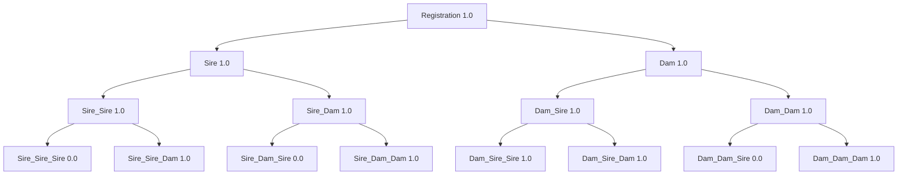
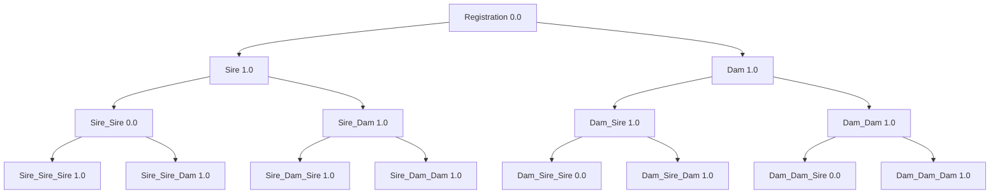

# Graph for DN62902502




# Graph for DN67178403


# Graph for DN35622501


# Graph for DN35622503


# Graph for DN49425304


# Graph for DN47188802


# Graph for DN49425301


# Graph for DN49425303


# Graph for DN49425302


# Graph for DN47188801/NOREG1997086


# Graph for DN63292204


# Graph for DN47188803


# Graph for DN63292202


# Graph for DN63292201


# Graph for DN63292205


# Graph for DN63292203


# Graph for DN36084105


# Graph for DN36084103




# Graph for DN48404901


# Graph for DN44626901


# Graph for DN64689302

```mermaid
    graph TD
    Registration[Registration 2.0]-->Sire[Sire 2.0]
    Registration-->Dam[Dam 1.0]
    Sire[Sire 2.0]-->Sire_Sire[Sire_Sire 1.0]
    Sire-->Sire_Dam[Sire_Dam 1.0]
    Dam[Dam 1.0]-->Dam_Sire[Dam_Sire 1.0]
    Dam-->Dam_Dam[Dam_Dam 0.0]
    Sire_Sire[Sire_Sire 1.0]-->Sire_Sire_Sire[Sire_Sire_Sire 1.0]
    Sire_Sire-->Sire_Sire_Dam[Sire_Sire_Dam 1.0]
    Sire_Dam[Sire_Dam 1.0]-->Sire_Dam_Sire[Sire_Dam_Sire 1.0]
    Sire_Dam-->Sire_Dam_Dam[Sire_Dam_Dam 1.0]
    Dam_Sire[Dam_Sire 1.0]-->Dam_Sire_Sire[Dam_Sire_Sire 0.0]
    Dam_Sire-->Dam_Sire_Dam[Dam_Sire_Dam 1.0]
    Dam_Dam[Dam_Dam 0.0]-->Dam_Dam_Sire[Dam_Dam_Sire 1.0]
    Dam_Dam-->Dam_Dam_Dam[Dam_Dam_Dam 1.0]
```


# Graph for DN68507103

```mermaid
    graph TD
    Registration[Registration 1.0]-->Sire[Sire 0.0]
    Registration-->Dam[Dam 2.0]
    Sire[Sire 0.0]-->Sire_Sire[Sire_Sire 0.0]
    Sire-->Sire_Dam[Sire_Dam 1.0]
    Dam[Dam 2.0]-->Dam_Sire[Dam_Sire 2.0]
    Dam-->Dam_Dam[Dam_Dam 1.0]
    Sire_Sire[Sire_Sire 0.0]-->Sire_Sire_Sire[Sire_Sire_Sire 1.0]
    Sire_Sire-->Sire_Sire_Dam[Sire_Sire_Dam 1.0]
    Sire_Dam[Sire_Dam 1.0]-->Sire_Dam_Sire[Sire_Dam_Sire 1.0]
    Sire_Dam-->Sire_Dam_Dam[Sire_Dam_Dam 1.0]
    Dam_Sire[Dam_Sire 2.0]-->Dam_Sire_Sire[Dam_Sire_Sire 2.0]
    Dam_Sire-->Dam_Sire_Dam[Dam_Sire_Dam 1.0]
    Dam_Dam[Dam_Dam 1.0]-->Dam_Dam_Sire[Dam_Dam_Sire 1.0]
    Dam_Dam-->Dam_Dam_Dam[Dam_Dam_Dam 1.0]
```


# Graph for DN68507101

```mermaid
    graph TD
    Registration[Registration 1.0]-->Sire[Sire 0.0]
    Registration-->Dam[Dam 2.0]
    Sire[Sire 0.0]-->Sire_Sire[Sire_Sire 0.0]
    Sire-->Sire_Dam[Sire_Dam 1.0]
    Dam[Dam 2.0]-->Dam_Sire[Dam_Sire 2.0]
    Dam-->Dam_Dam[Dam_Dam 1.0]
    Sire_Sire[Sire_Sire 0.0]-->Sire_Sire_Sire[Sire_Sire_Sire 1.0]
    Sire_Sire-->Sire_Sire_Dam[Sire_Sire_Dam 1.0]
    Sire_Dam[Sire_Dam 1.0]-->Sire_Dam_Sire[Sire_Dam_Sire 1.0]
    Sire_Dam-->Sire_Dam_Dam[Sire_Dam_Dam 1.0]
    Dam_Sire[Dam_Sire 2.0]-->Dam_Sire_Sire[Dam_Sire_Sire 2.0]
    Dam_Sire-->Dam_Sire_Dam[Dam_Sire_Dam 1.0]
    Dam_Dam[Dam_Dam 1.0]-->Dam_Dam_Sire[Dam_Dam_Sire 1.0]
    Dam_Dam-->Dam_Dam_Dam[Dam_Dam_Dam 1.0]
```


# Graph for DN64677801

```mermaid
    graph TD
    Registration[Registration 1.0]-->Sire[Sire 2.0]
    Registration-->Dam[Dam 1.0]
    Sire[Sire 2.0]-->Sire_Sire[Sire_Sire 0.0]
    Sire-->Sire_Dam[Sire_Dam 1.0]
    Dam[Dam 1.0]-->Dam_Sire[Dam_Sire 0.0]
    Dam-->Dam_Dam[Dam_Dam 1.0]
    Sire_Sire[Sire_Sire 0.0]-->Sire_Sire_Sire[Sire_Sire_Sire 1.0]
    Sire_Sire-->Sire_Sire_Dam[Sire_Sire_Dam 1.0]
    Sire_Dam[Sire_Dam 1.0]-->Sire_Dam_Sire[Sire_Dam_Sire 0.0]
    Sire_Dam-->Sire_Dam_Dam[Sire_Dam_Dam 1.0]
    Dam_Sire[Dam_Sire 0.0]-->Dam_Sire_Sire[Dam_Sire_Sire 1.0]
    Dam_Sire-->Dam_Sire_Dam[Dam_Sire_Dam 1.0]
    Dam_Dam[Dam_Dam 1.0]-->Dam_Dam_Sire[Dam_Dam_Sire 1.0]
    Dam_Dam-->Dam_Dam_Dam[Dam_Dam_Dam 1.0]
```


# Graph for DN64960901

```mermaid
    graph TD
    Registration[Registration 0.0]-->Sire[Sire 1.0]
    Registration-->Dam[Dam 0.0]
    Sire[Sire 1.0]-->Sire_Sire[Sire_Sire 1.0]
    Sire-->Sire_Dam[Sire_Dam 1.0]
    Dam[Dam 0.0]-->Dam_Sire[Dam_Sire 1.0]
    Dam-->Dam_Dam[Dam_Dam 1.0]
    Sire_Sire[Sire_Sire 1.0]-->Sire_Sire_Sire[Sire_Sire_Sire 1.0]
    Sire_Sire-->Sire_Sire_Dam[Sire_Sire_Dam 1.0]
    Sire_Dam[Sire_Dam 1.0]-->Sire_Dam_Sire[Sire_Dam_Sire 0.0]
    Sire_Dam-->Sire_Dam_Dam[Sire_Dam_Dam 1.0]
    Dam_Sire[Dam_Sire 1.0]-->Dam_Sire_Sire[Dam_Sire_Sire 1.0]
    Dam_Sire-->Dam_Sire_Dam[Dam_Sire_Dam 1.0]
    Dam_Dam[Dam_Dam 1.0]-->Dam_Dam_Sire[Dam_Dam_Sire 1.0]
    Dam_Dam-->Dam_Dam_Dam[Dam_Dam_Dam 1.0]
```


# Graph for DN68507102

```mermaid
    graph TD
    Registration[Registration 1.0]-->Sire[Sire 0.0]
    Registration-->Dam[Dam 2.0]
    Sire[Sire 0.0]-->Sire_Sire[Sire_Sire 0.0]
    Sire-->Sire_Dam[Sire_Dam 1.0]
    Dam[Dam 2.0]-->Dam_Sire[Dam_Sire 2.0]
    Dam-->Dam_Dam[Dam_Dam 1.0]
    Sire_Sire[Sire_Sire 0.0]-->Sire_Sire_Sire[Sire_Sire_Sire 1.0]
    Sire_Sire-->Sire_Sire_Dam[Sire_Sire_Dam 1.0]
    Sire_Dam[Sire_Dam 1.0]-->Sire_Dam_Sire[Sire_Dam_Sire 1.0]
    Sire_Dam-->Sire_Dam_Dam[Sire_Dam_Dam 1.0]
    Dam_Sire[Dam_Sire 2.0]-->Dam_Sire_Sire[Dam_Sire_Sire 2.0]
    Dam_Sire-->Dam_Sire_Dam[Dam_Sire_Dam 1.0]
    Dam_Dam[Dam_Dam 1.0]-->Dam_Dam_Sire[Dam_Dam_Sire 1.0]
    Dam_Dam-->Dam_Dam_Dam[Dam_Dam_Dam 1.0]
```


# Graph for DN73283903/D173572

```mermaid
    graph TD
    Registration[Registration 1.0]-->Sire[Sire 2.0]
    Registration-->Dam[Dam 1.0]
    Sire[Sire 2.0]-->Sire_Sire[Sire_Sire 0.0]
    Sire-->Sire_Dam[Sire_Dam 1.0]
    Dam[Dam 1.0]-->Dam_Sire[Dam_Sire 1.0]
    Dam-->Dam_Dam[Dam_Dam 1.0]
    Sire_Sire[Sire_Sire 0.0]-->Sire_Sire_Sire[Sire_Sire_Sire 1.0]
    Sire_Sire-->Sire_Sire_Dam[Sire_Sire_Dam 1.0]
    Sire_Dam[Sire_Dam 1.0]-->Sire_Dam_Sire[Sire_Dam_Sire 0.0]
    Sire_Dam-->Sire_Dam_Dam[Sire_Dam_Dam 1.0]
    Dam_Sire[Dam_Sire 1.0]-->Dam_Sire_Sire[Dam_Sire_Sire 1.0]
    Dam_Sire-->Dam_Sire_Dam[Dam_Sire_Dam 1.0]
    Dam_Dam[Dam_Dam 1.0]-->Dam_Dam_Sire[Dam_Dam_Sire 1.0]
    Dam_Dam-->Dam_Dam_Dam[Dam_Dam_Dam 1.0]
```


# Graph for DN60487203

```mermaid
    graph TD
    Registration[Registration 1.0]-->Sire[Sire 1.0]
    Registration-->Dam[Dam 0.0]
    Sire[Sire 1.0]-->Sire_Sire[Sire_Sire 1.0]
    Sire-->Sire_Dam[Sire_Dam 1.0]
    Dam[Dam 0.0]-->Dam_Sire[Dam_Sire 1.0]
    Dam-->Dam_Dam[Dam_Dam 1.0]
    Sire_Sire[Sire_Sire 1.0]-->Sire_Sire_Sire[Sire_Sire_Sire 2.0]
    Sire_Sire-->Sire_Sire_Dam[Sire_Sire_Dam 1.0]
    Sire_Dam[Sire_Dam 1.0]-->Sire_Dam_Sire[Sire_Dam_Sire 1.0]
    Sire_Dam-->Sire_Dam_Dam[Sire_Dam_Dam 1.0]
    Dam_Sire[Dam_Sire 1.0]-->Dam_Sire_Sire[Dam_Sire_Sire 1.0]
    Dam_Sire-->Dam_Sire_Dam[Dam_Sire_Dam 1.0]
    Dam_Dam[Dam_Dam 1.0]-->Dam_Dam_Sire[Dam_Dam_Sire 1.0]
    Dam_Dam-->Dam_Dam_Dam[Dam_Dam_Dam 1.0]
```


# Graph for DN68508401

```mermaid
    graph TD
    Registration[Registration 2.0]-->Sire[Sire 1.0]
    Registration-->Dam[Dam 2.0]
    Sire[Sire 1.0]-->Sire_Sire[Sire_Sire 1.0]
    Sire-->Sire_Dam[Sire_Dam 1.0]
    Dam[Dam 2.0]-->Dam_Sire[Dam_Sire 1.0]
    Dam-->Dam_Dam[Dam_Dam 1.0]
    Sire_Sire[Sire_Sire 1.0]-->Sire_Sire_Sire[Sire_Sire_Sire 2.0]
    Sire_Sire-->Sire_Sire_Dam[Sire_Sire_Dam 1.0]
    Sire_Dam[Sire_Dam 1.0]-->Sire_Dam_Sire[Sire_Dam_Sire 1.0]
    Sire_Dam-->Sire_Dam_Dam[Sire_Dam_Dam 1.0]
    Dam_Sire[Dam_Sire 1.0]-->Dam_Sire_Sire[Dam_Sire_Sire 1.0]
    Dam_Sire-->Dam_Sire_Dam[Dam_Sire_Dam 1.0]
    Dam_Dam[Dam_Dam 1.0]-->Dam_Dam_Sire[Dam_Dam_Sire 0.0]
    Dam_Dam-->Dam_Dam_Dam[Dam_Dam_Dam 1.0]
```


# Graph for DN64677901

```mermaid
    graph TD
    Registration[Registration 4.0]-->Sire[Sire 2.0]
    Registration-->Dam[Dam 1.0]
    Sire[Sire 2.0]-->Sire_Sire[Sire_Sire 0.0]
    Sire-->Sire_Dam[Sire_Dam 1.0]
    Dam[Dam 1.0]-->Dam_Sire[Dam_Sire 1.0]
    Dam-->Dam_Dam[Dam_Dam 1.0]
    Sire_Sire[Sire_Sire 0.0]-->Sire_Sire_Sire[Sire_Sire_Sire 1.0]
    Sire_Sire-->Sire_Sire_Dam[Sire_Sire_Dam 1.0]
    Sire_Dam[Sire_Dam 1.0]-->Sire_Dam_Sire[Sire_Dam_Sire 0.0]
    Sire_Dam-->Sire_Dam_Dam[Sire_Dam_Dam 1.0]
    Dam_Sire[Dam_Sire 1.0]-->Dam_Sire_Sire[Dam_Sire_Sire 1.0]
    Dam_Sire-->Dam_Sire_Dam[Dam_Sire_Dam 1.0]
    Dam_Dam[Dam_Dam 1.0]-->Dam_Dam_Sire[Dam_Dam_Sire 1.0]
    Dam_Dam-->Dam_Dam_Dam[Dam_Dam_Dam 1.0]
```


# Graph for DN59561301

```mermaid
    graph TD
    Registration[Registration 5.0]-->Sire[Sire 1.0]
    Registration-->Dam[Dam 2.0]
    Sire[Sire 1.0]-->Sire_Sire[Sire_Sire 1.0]
    Sire-->Sire_Dam[Sire_Dam 1.0]
    Dam[Dam 2.0]-->Dam_Sire[Dam_Sire 2.0]
    Dam-->Dam_Dam[Dam_Dam 1.0]
    Sire_Sire[Sire_Sire 1.0]-->Sire_Sire_Sire[Sire_Sire_Sire 1.0]
    Sire_Sire-->Sire_Sire_Dam[Sire_Sire_Dam 1.0]
    Sire_Dam[Sire_Dam 1.0]-->Sire_Dam_Sire[Sire_Dam_Sire 1.0]
    Sire_Dam-->Sire_Dam_Dam[Sire_Dam_Dam 1.0]
    Dam_Sire[Dam_Sire 2.0]-->Dam_Sire_Sire[Dam_Sire_Sire 2.0]
    Dam_Sire-->Dam_Sire_Dam[Dam_Sire_Dam 1.0]
    Dam_Dam[Dam_Dam 1.0]-->Dam_Dam_Sire[Dam_Dam_Sire 1.0]
    Dam_Dam-->Dam_Dam_Dam[Dam_Dam_Dam 1.0]
```


# Graph for DN47495901

```mermaid
    graph TD
    Registration[Registration 0.0]-->Sire[Sire 1.0]
    Registration-->Dam[Dam 1.0]
    Sire[Sire 1.0]-->Sire_Sire[Sire_Sire 1.0]
    Sire-->Sire_Dam[Sire_Dam 1.0]
    Dam[Dam 1.0]-->Dam_Sire[Dam_Sire 0.0]
    Dam-->Dam_Dam[Dam_Dam 1.0]
    Sire_Sire[Sire_Sire 1.0]-->Sire_Sire_Sire[Sire_Sire_Sire 1.0]
    Sire_Sire-->Sire_Sire_Dam[Sire_Sire_Dam 1.0]
    Sire_Dam[Sire_Dam 1.0]-->Sire_Dam_Sire[Sire_Dam_Sire 0.0]
    Sire_Dam-->Sire_Dam_Dam[Sire_Dam_Dam 1.0]
    Dam_Sire[Dam_Sire 0.0]-->Dam_Sire_Sire[Dam_Sire_Sire 0.0]
    Dam_Sire-->Dam_Sire_Dam[Dam_Sire_Dam 1.0]
    Dam_Dam[Dam_Dam 1.0]-->Dam_Dam_Sire[Dam_Dam_Sire 1.0]
    Dam_Dam-->Dam_Dam_Dam[Dam_Dam_Dam 1.0]
```


# Graph for DN47495903

```mermaid
    graph TD
    Registration[Registration 1.0]-->Sire[Sire 1.0]
    Registration-->Dam[Dam 1.0]
    Sire[Sire 1.0]-->Sire_Sire[Sire_Sire 1.0]
    Sire-->Sire_Dam[Sire_Dam 1.0]
    Dam[Dam 1.0]-->Dam_Sire[Dam_Sire 0.0]
    Dam-->Dam_Dam[Dam_Dam 1.0]
    Sire_Sire[Sire_Sire 1.0]-->Sire_Sire_Sire[Sire_Sire_Sire 1.0]
    Sire_Sire-->Sire_Sire_Dam[Sire_Sire_Dam 1.0]
    Sire_Dam[Sire_Dam 1.0]-->Sire_Dam_Sire[Sire_Dam_Sire 0.0]
    Sire_Dam-->Sire_Dam_Dam[Sire_Dam_Dam 1.0]
    Dam_Sire[Dam_Sire 0.0]-->Dam_Sire_Sire[Dam_Sire_Sire 0.0]
    Dam_Sire-->Dam_Sire_Dam[Dam_Sire_Dam 1.0]
    Dam_Dam[Dam_Dam 1.0]-->Dam_Dam_Sire[Dam_Dam_Sire 1.0]
    Dam_Dam-->Dam_Dam_Dam[Dam_Dam_Dam 1.0]
```


# Graph for DN47495902

```mermaid
    graph TD
    Registration[Registration 1.0]-->Sire[Sire 1.0]
    Registration-->Dam[Dam 1.0]
    Sire[Sire 1.0]-->Sire_Sire[Sire_Sire 1.0]
    Sire-->Sire_Dam[Sire_Dam 1.0]
    Dam[Dam 1.0]-->Dam_Sire[Dam_Sire 0.0]
    Dam-->Dam_Dam[Dam_Dam 1.0]
    Sire_Sire[Sire_Sire 1.0]-->Sire_Sire_Sire[Sire_Sire_Sire 1.0]
    Sire_Sire-->Sire_Sire_Dam[Sire_Sire_Dam 1.0]
    Sire_Dam[Sire_Dam 1.0]-->Sire_Dam_Sire[Sire_Dam_Sire 0.0]
    Sire_Dam-->Sire_Dam_Dam[Sire_Dam_Dam 1.0]
    Dam_Sire[Dam_Sire 0.0]-->Dam_Sire_Sire[Dam_Sire_Sire 0.0]
    Dam_Sire-->Dam_Sire_Dam[Dam_Sire_Dam 1.0]
    Dam_Dam[Dam_Dam 1.0]-->Dam_Dam_Sire[Dam_Dam_Sire 1.0]
    Dam_Dam-->Dam_Dam_Dam[Dam_Dam_Dam 1.0]
```


# Graph for DN48340504

```mermaid
    graph TD
    Registration[Registration 1.0]-->Sire[Sire 1.0]
    Registration-->Dam[Dam 1.0]
    Sire[Sire 1.0]-->Sire_Sire[Sire_Sire 1.0]
    Sire-->Sire_Dam[Sire_Dam 1.0]
    Dam[Dam 1.0]-->Dam_Sire[Dam_Sire 1.0]
    Dam-->Dam_Dam[Dam_Dam 1.0]
    Sire_Sire[Sire_Sire 1.0]-->Sire_Sire_Sire[Sire_Sire_Sire 1.0]
    Sire_Sire-->Sire_Sire_Dam[Sire_Sire_Dam 1.0]
    Sire_Dam[Sire_Dam 1.0]-->Sire_Dam_Sire[Sire_Dam_Sire 0.0]
    Sire_Dam-->Sire_Dam_Dam[Sire_Dam_Dam 1.0]
    Dam_Sire[Dam_Sire 1.0]-->Dam_Sire_Sire[Dam_Sire_Sire 1.0]
    Dam_Sire-->Dam_Sire_Dam[Dam_Sire_Dam 0.0]
    Dam_Dam[Dam_Dam 1.0]-->Dam_Dam_Sire[Dam_Dam_Sire 1.0]
    Dam_Dam-->Dam_Dam_Dam[Dam_Dam_Dam 1.0]
```


# Graph for DN40704701

```mermaid
    graph TD
    Registration[Registration 1.0]-->Sire[Sire 1.0]
    Registration-->Dam[Dam 1.0]
    Sire[Sire 1.0]-->Sire_Sire[Sire_Sire 1.0]
    Sire-->Sire_Dam[Sire_Dam 1.0]
    Dam[Dam 1.0]-->Dam_Sire[Dam_Sire 0.0]
    Dam-->Dam_Dam[Dam_Dam 1.0]
    Sire_Sire[Sire_Sire 1.0]-->Sire_Sire_Sire[Sire_Sire_Sire 1.0]
    Sire_Sire-->Sire_Sire_Dam[Sire_Sire_Dam 1.0]
    Sire_Dam[Sire_Dam 1.0]-->Sire_Dam_Sire[Sire_Dam_Sire 0.0]
    Sire_Dam-->Sire_Dam_Dam[Sire_Dam_Dam 1.0]
    Dam_Sire[Dam_Sire 0.0]-->Dam_Sire_Sire[Dam_Sire_Sire 0.0]
    Dam_Sire-->Dam_Sire_Dam[Dam_Sire_Dam 1.0]
    Dam_Dam[Dam_Dam 1.0]-->Dam_Dam_Sire[Dam_Dam_Sire 1.0]
    Dam_Dam-->Dam_Dam_Dam[Dam_Dam_Dam 1.0]
```


# Graph for DN48340506

```mermaid
    graph TD
    Registration[Registration 1.0]-->Sire[Sire 1.0]
    Registration-->Dam[Dam 1.0]
    Sire[Sire 1.0]-->Sire_Sire[Sire_Sire 1.0]
    Sire-->Sire_Dam[Sire_Dam 1.0]
    Dam[Dam 1.0]-->Dam_Sire[Dam_Sire 1.0]
    Dam-->Dam_Dam[Dam_Dam 1.0]
    Sire_Sire[Sire_Sire 1.0]-->Sire_Sire_Sire[Sire_Sire_Sire 1.0]
    Sire_Sire-->Sire_Sire_Dam[Sire_Sire_Dam 1.0]
    Sire_Dam[Sire_Dam 1.0]-->Sire_Dam_Sire[Sire_Dam_Sire 0.0]
    Sire_Dam-->Sire_Dam_Dam[Sire_Dam_Dam 1.0]
    Dam_Sire[Dam_Sire 1.0]-->Dam_Sire_Sire[Dam_Sire_Sire 1.0]
    Dam_Sire-->Dam_Sire_Dam[Dam_Sire_Dam 0.0]
    Dam_Dam[Dam_Dam 1.0]-->Dam_Dam_Sire[Dam_Dam_Sire 1.0]
    Dam_Dam-->Dam_Dam_Dam[Dam_Dam_Dam 1.0]
```


# Graph for DN48340501

```mermaid
    graph TD
    Registration[Registration 1.0]-->Sire[Sire 1.0]
    Registration-->Dam[Dam 1.0]
    Sire[Sire 1.0]-->Sire_Sire[Sire_Sire 1.0]
    Sire-->Sire_Dam[Sire_Dam 1.0]
    Dam[Dam 1.0]-->Dam_Sire[Dam_Sire 1.0]
    Dam-->Dam_Dam[Dam_Dam 1.0]
    Sire_Sire[Sire_Sire 1.0]-->Sire_Sire_Sire[Sire_Sire_Sire 1.0]
    Sire_Sire-->Sire_Sire_Dam[Sire_Sire_Dam 1.0]
    Sire_Dam[Sire_Dam 1.0]-->Sire_Dam_Sire[Sire_Dam_Sire 0.0]
    Sire_Dam-->Sire_Dam_Dam[Sire_Dam_Dam 1.0]
    Dam_Sire[Dam_Sire 1.0]-->Dam_Sire_Sire[Dam_Sire_Sire 1.0]
    Dam_Sire-->Dam_Sire_Dam[Dam_Sire_Dam 0.0]
    Dam_Dam[Dam_Dam 1.0]-->Dam_Dam_Sire[Dam_Dam_Sire 1.0]
    Dam_Dam-->Dam_Dam_Dam[Dam_Dam_Dam 1.0]
```


# Graph for DN67243001

```mermaid
    graph TD
    Registration[Registration 1.0]-->Sire[Sire 1.0]
    Registration-->Dam[Dam 1.0]
    Sire[Sire 1.0]-->Sire_Sire[Sire_Sire 1.0]
    Sire-->Sire_Dam[Sire_Dam 1.0]
    Dam[Dam 1.0]-->Dam_Sire[Dam_Sire 1.0]
    Dam-->Dam_Dam[Dam_Dam 0.0]
    Sire_Sire[Sire_Sire 1.0]-->Sire_Sire_Sire[Sire_Sire_Sire 0.0]
    Sire_Sire-->Sire_Sire_Dam[Sire_Sire_Dam 1.0]
    Sire_Dam[Sire_Dam 1.0]-->Sire_Dam_Sire[Sire_Dam_Sire 0.0]
    Sire_Dam-->Sire_Dam_Dam[Sire_Dam_Dam 1.0]
    Dam_Sire[Dam_Sire 1.0]-->Dam_Sire_Sire[Dam_Sire_Sire 1.0]
    Dam_Sire-->Dam_Sire_Dam[Dam_Sire_Dam 1.0]
    Dam_Dam[Dam_Dam 0.0]-->Dam_Dam_Sire[Dam_Dam_Sire 1.0]
    Dam_Dam-->Dam_Dam_Dam[Dam_Dam_Dam 0.0]
```


# Graph for DN67243003

```mermaid
    graph TD
    Registration[Registration 1.0]-->Sire[Sire 1.0]
    Registration-->Dam[Dam 1.0]
    Sire[Sire 1.0]-->Sire_Sire[Sire_Sire 1.0]
    Sire-->Sire_Dam[Sire_Dam 1.0]
    Dam[Dam 1.0]-->Dam_Sire[Dam_Sire 1.0]
    Dam-->Dam_Dam[Dam_Dam 0.0]
    Sire_Sire[Sire_Sire 1.0]-->Sire_Sire_Sire[Sire_Sire_Sire 0.0]
    Sire_Sire-->Sire_Sire_Dam[Sire_Sire_Dam 1.0]
    Sire_Dam[Sire_Dam 1.0]-->Sire_Dam_Sire[Sire_Dam_Sire 0.0]
    Sire_Dam-->Sire_Dam_Dam[Sire_Dam_Dam 1.0]
    Dam_Sire[Dam_Sire 1.0]-->Dam_Sire_Sire[Dam_Sire_Sire 1.0]
    Dam_Sire-->Dam_Sire_Dam[Dam_Sire_Dam 1.0]
    Dam_Dam[Dam_Dam 0.0]-->Dam_Dam_Sire[Dam_Dam_Sire 1.0]
    Dam_Dam-->Dam_Dam_Dam[Dam_Dam_Dam 0.0]
```


# Graph for DN67243002

```mermaid
    graph TD
    Registration[Registration 1.0]-->Sire[Sire 1.0]
    Registration-->Dam[Dam 1.0]
    Sire[Sire 1.0]-->Sire_Sire[Sire_Sire 1.0]
    Sire-->Sire_Dam[Sire_Dam 1.0]
    Dam[Dam 1.0]-->Dam_Sire[Dam_Sire 1.0]
    Dam-->Dam_Dam[Dam_Dam 0.0]
    Sire_Sire[Sire_Sire 1.0]-->Sire_Sire_Sire[Sire_Sire_Sire 0.0]
    Sire_Sire-->Sire_Sire_Dam[Sire_Sire_Dam 1.0]
    Sire_Dam[Sire_Dam 1.0]-->Sire_Dam_Sire[Sire_Dam_Sire 0.0]
    Sire_Dam-->Sire_Dam_Dam[Sire_Dam_Dam 1.0]
    Dam_Sire[Dam_Sire 1.0]-->Dam_Sire_Sire[Dam_Sire_Sire 1.0]
    Dam_Sire-->Dam_Sire_Dam[Dam_Sire_Dam 1.0]
    Dam_Dam[Dam_Dam 0.0]-->Dam_Dam_Sire[Dam_Dam_Sire 1.0]
    Dam_Dam-->Dam_Dam_Dam[Dam_Dam_Dam 0.0]
```


# Graph for DN31377206

```mermaid
    graph TD
    Registration[Registration 1.0]-->Sire[Sire 1.0]
    Registration-->Dam[Dam 1.0]
    Sire[Sire 1.0]-->Sire_Sire[Sire_Sire 1.0]
    Sire-->Sire_Dam[Sire_Dam 1.0]
    Dam[Dam 1.0]-->Dam_Sire[Dam_Sire 1.0]
    Dam-->Dam_Dam[Dam_Dam 2.0]
    Sire_Sire[Sire_Sire 1.0]-->Sire_Sire_Sire[Sire_Sire_Sire 1.0]
    Sire_Sire-->Sire_Sire_Dam[Sire_Sire_Dam 1.0]
    Sire_Dam[Sire_Dam 1.0]-->Sire_Dam_Sire[Sire_Dam_Sire 1.0]
    Sire_Dam-->Sire_Dam_Dam[Sire_Dam_Dam 1.0]
    Dam_Sire[Dam_Sire 1.0]-->Dam_Sire_Sire[Dam_Sire_Sire 2.0]
    Dam_Sire-->Dam_Sire_Dam[Dam_Sire_Dam 1.0]
    Dam_Dam[Dam_Dam 2.0]-->Dam_Dam_Sire[Dam_Dam_Sire 1.0]
    Dam_Dam-->Dam_Dam_Dam[Dam_Dam_Dam 1.0]
```


# Graph for DN31377208

```mermaid
    graph TD
    Registration[Registration 1.0]-->Sire[Sire 1.0]
    Registration-->Dam[Dam 1.0]
    Sire[Sire 1.0]-->Sire_Sire[Sire_Sire 1.0]
    Sire-->Sire_Dam[Sire_Dam 1.0]
    Dam[Dam 1.0]-->Dam_Sire[Dam_Sire 1.0]
    Dam-->Dam_Dam[Dam_Dam 2.0]
    Sire_Sire[Sire_Sire 1.0]-->Sire_Sire_Sire[Sire_Sire_Sire 1.0]
    Sire_Sire-->Sire_Sire_Dam[Sire_Sire_Dam 1.0]
    Sire_Dam[Sire_Dam 1.0]-->Sire_Dam_Sire[Sire_Dam_Sire 1.0]
    Sire_Dam-->Sire_Dam_Dam[Sire_Dam_Dam 1.0]
    Dam_Sire[Dam_Sire 1.0]-->Dam_Sire_Sire[Dam_Sire_Sire 2.0]
    Dam_Sire-->Dam_Sire_Dam[Dam_Sire_Dam 1.0]
    Dam_Dam[Dam_Dam 2.0]-->Dam_Dam_Sire[Dam_Dam_Sire 1.0]
    Dam_Dam-->Dam_Dam_Dam[Dam_Dam_Dam 1.0]
```


# Graph for DN70516201

```mermaid
    graph TD
    Registration[Registration 1.0]-->Sire[Sire 0.0]
    Registration-->Dam[Dam 1.0]
    Sire[Sire 0.0]-->Sire_Sire[Sire_Sire 0.0]
    Sire-->Sire_Dam[Sire_Dam 0.0]
    Dam[Dam 1.0]-->Dam_Sire[Dam_Sire 1.0]
    Dam-->Dam_Dam[Dam_Dam 0.0]
    Sire_Sire[Sire_Sire 0.0]-->Sire_Sire_Sire[Sire_Sire_Sire 1.0]
    Sire_Sire-->Sire_Sire_Dam[Sire_Sire_Dam 1.0]
    Sire_Dam[Sire_Dam 0.0]-->Sire_Dam_Sire[Sire_Dam_Sire 1.0]
    Sire_Dam-->Sire_Dam_Dam[Sire_Dam_Dam 1.0]
    Dam_Sire[Dam_Sire 1.0]-->Dam_Sire_Sire[Dam_Sire_Sire 1.0]
    Dam_Sire-->Dam_Sire_Dam[Dam_Sire_Dam 0.0]
    Dam_Dam[Dam_Dam 0.0]-->Dam_Dam_Sire[Dam_Dam_Sire 1.0]
    Dam_Dam-->Dam_Dam_Dam[Dam_Dam_Dam 1.0]
```


# Graph for DN64316301

```mermaid
    graph TD
    Registration[Registration 1.0]-->Sire[Sire 1.0]
    Registration-->Dam[Dam 2.0]
    Sire[Sire 1.0]-->Sire_Sire[Sire_Sire 1.0]
    Sire-->Sire_Dam[Sire_Dam 1.0]
    Dam[Dam 2.0]-->Dam_Sire[Dam_Sire 1.0]
    Dam-->Dam_Dam[Dam_Dam 1.0]
    Sire_Sire[Sire_Sire 1.0]-->Sire_Sire_Sire[Sire_Sire_Sire 1.0]
    Sire_Sire-->Sire_Sire_Dam[Sire_Sire_Dam 1.0]
    Sire_Dam[Sire_Dam 1.0]-->Sire_Dam_Sire[Sire_Dam_Sire 1.0]
    Sire_Dam-->Sire_Dam_Dam[Sire_Dam_Dam 0.0]
    Dam_Sire[Dam_Sire 1.0]-->Dam_Sire_Sire[Dam_Sire_Sire 1.0]
    Dam_Sire-->Dam_Sire_Dam[Dam_Sire_Dam 1.0]
    Dam_Dam[Dam_Dam 1.0]-->Dam_Dam_Sire[Dam_Dam_Sire 0.0]
    Dam_Dam-->Dam_Dam_Dam[Dam_Dam_Dam 1.0]
```


# Graph for DN55939202

```mermaid
    graph TD
    Registration[Registration 1.0]-->Sire[Sire 1.0]
    Registration-->Dam[Dam 1.0]
    Sire[Sire 1.0]-->Sire_Sire[Sire_Sire 1.0]
    Sire-->Sire_Dam[Sire_Dam 0.0]
    Dam[Dam 1.0]-->Dam_Sire[Dam_Sire 1.0]
    Dam-->Dam_Dam[Dam_Dam 1.0]
    Sire_Sire[Sire_Sire 1.0]-->Sire_Sire_Sire[Sire_Sire_Sire 1.0]
    Sire_Sire-->Sire_Sire_Dam[Sire_Sire_Dam 1.0]
    Sire_Dam[Sire_Dam 0.0]-->Sire_Dam_Sire[Sire_Dam_Sire 1.0]
    Sire_Dam-->Sire_Dam_Dam[Sire_Dam_Dam 0.0]
    Dam_Sire[Dam_Sire 1.0]-->Dam_Sire_Sire[Dam_Sire_Sire 1.0]
    Dam_Sire-->Dam_Sire_Dam[Dam_Sire_Dam 1.0]
    Dam_Dam[Dam_Dam 1.0]-->Dam_Dam_Sire[Dam_Dam_Sire 1.0]
    Dam_Dam-->Dam_Dam_Dam[Dam_Dam_Dam 0.0]
```


# Graph for DN55939204

```mermaid
    graph TD
    Registration[Registration 1.0]-->Sire[Sire 1.0]
    Registration-->Dam[Dam 1.0]
    Sire[Sire 1.0]-->Sire_Sire[Sire_Sire 1.0]
    Sire-->Sire_Dam[Sire_Dam 0.0]
    Dam[Dam 1.0]-->Dam_Sire[Dam_Sire 1.0]
    Dam-->Dam_Dam[Dam_Dam 1.0]
    Sire_Sire[Sire_Sire 1.0]-->Sire_Sire_Sire[Sire_Sire_Sire 1.0]
    Sire_Sire-->Sire_Sire_Dam[Sire_Sire_Dam 1.0]
    Sire_Dam[Sire_Dam 0.0]-->Sire_Dam_Sire[Sire_Dam_Sire 1.0]
    Sire_Dam-->Sire_Dam_Dam[Sire_Dam_Dam 0.0]
    Dam_Sire[Dam_Sire 1.0]-->Dam_Sire_Sire[Dam_Sire_Sire 1.0]
    Dam_Sire-->Dam_Sire_Dam[Dam_Sire_Dam 1.0]
    Dam_Dam[Dam_Dam 1.0]-->Dam_Dam_Sire[Dam_Dam_Sire 1.0]
    Dam_Dam-->Dam_Dam_Dam[Dam_Dam_Dam 0.0]
```


# Graph for DN67500403

```mermaid
    graph TD
    Registration[Registration 1.0]-->Sire[Sire 1.0]
    Registration-->Dam[Dam 1.0]
    Sire[Sire 1.0]-->Sire_Sire[Sire_Sire 1.0]
    Sire-->Sire_Dam[Sire_Dam 1.0]
    Dam[Dam 1.0]-->Dam_Sire[Dam_Sire 1.0]
    Dam-->Dam_Dam[Dam_Dam 1.0]
    Sire_Sire[Sire_Sire 1.0]-->Sire_Sire_Sire[Sire_Sire_Sire 1.0]
    Sire_Sire-->Sire_Sire_Dam[Sire_Sire_Dam 0.0]
    Sire_Dam[Sire_Dam 1.0]-->Sire_Dam_Sire[Sire_Dam_Sire 1.0]
    Sire_Dam-->Sire_Dam_Dam[Sire_Dam_Dam 1.0]
    Dam_Sire[Dam_Sire 1.0]-->Dam_Sire_Sire[Dam_Sire_Sire 0.0]
    Dam_Sire-->Dam_Sire_Dam[Dam_Sire_Dam 0.0]
    Dam_Dam[Dam_Dam 1.0]-->Dam_Dam_Sire[Dam_Dam_Sire 1.0]
    Dam_Dam-->Dam_Dam_Dam[Dam_Dam_Dam 1.0]
```


# Graph for DN67500407

```mermaid
    graph TD
    Registration[Registration 2.0]-->Sire[Sire 1.0]
    Registration-->Dam[Dam 1.0]
    Sire[Sire 1.0]-->Sire_Sire[Sire_Sire 1.0]
    Sire-->Sire_Dam[Sire_Dam 1.0]
    Dam[Dam 1.0]-->Dam_Sire[Dam_Sire 1.0]
    Dam-->Dam_Dam[Dam_Dam 1.0]
    Sire_Sire[Sire_Sire 1.0]-->Sire_Sire_Sire[Sire_Sire_Sire 1.0]
    Sire_Sire-->Sire_Sire_Dam[Sire_Sire_Dam 0.0]
    Sire_Dam[Sire_Dam 1.0]-->Sire_Dam_Sire[Sire_Dam_Sire 1.0]
    Sire_Dam-->Sire_Dam_Dam[Sire_Dam_Dam 1.0]
    Dam_Sire[Dam_Sire 1.0]-->Dam_Sire_Sire[Dam_Sire_Sire 0.0]
    Dam_Sire-->Dam_Sire_Dam[Dam_Sire_Dam 0.0]
    Dam_Dam[Dam_Dam 1.0]-->Dam_Dam_Sire[Dam_Dam_Sire 1.0]
    Dam_Dam-->Dam_Dam_Dam[Dam_Dam_Dam 1.0]
```


# Graph for DN67665703/D105157

```mermaid
    graph TD
    Registration[Registration 1.0]-->Sire[Sire 0.0]
    Registration-->Dam[Dam 1.0]
    Sire[Sire 0.0]-->Sire_Sire[Sire_Sire 1.0]
    Sire-->Sire_Dam[Sire_Dam 1.0]
    Dam[Dam 1.0]-->Dam_Sire[Dam_Sire 1.0]
    Dam-->Dam_Dam[Dam_Dam 1.0]
    Sire_Sire[Sire_Sire 1.0]-->Sire_Sire_Sire[Sire_Sire_Sire 1.0]
    Sire_Sire-->Sire_Sire_Dam[Sire_Sire_Dam 1.0]
    Sire_Dam[Sire_Dam 1.0]-->Sire_Dam_Sire[Sire_Dam_Sire 0.0]
    Sire_Dam-->Sire_Dam_Dam[Sire_Dam_Dam 1.0]
    Dam_Sire[Dam_Sire 1.0]-->Dam_Sire_Sire[Dam_Sire_Sire 1.0]
    Dam_Sire-->Dam_Sire_Dam[Dam_Sire_Dam 1.0]
    Dam_Dam[Dam_Dam 1.0]-->Dam_Dam_Sire[Dam_Dam_Sire 1.0]
    Dam_Dam-->Dam_Dam_Dam[Dam_Dam_Dam 0.0]
```


# Graph for DN67665702

```mermaid
    graph TD
    Registration[Registration 1.0]-->Sire[Sire 0.0]
    Registration-->Dam[Dam 1.0]
    Sire[Sire 0.0]-->Sire_Sire[Sire_Sire 1.0]
    Sire-->Sire_Dam[Sire_Dam 1.0]
    Dam[Dam 1.0]-->Dam_Sire[Dam_Sire 1.0]
    Dam-->Dam_Dam[Dam_Dam 1.0]
    Sire_Sire[Sire_Sire 1.0]-->Sire_Sire_Sire[Sire_Sire_Sire 1.0]
    Sire_Sire-->Sire_Sire_Dam[Sire_Sire_Dam 1.0]
    Sire_Dam[Sire_Dam 1.0]-->Sire_Dam_Sire[Sire_Dam_Sire 0.0]
    Sire_Dam-->Sire_Dam_Dam[Sire_Dam_Dam 1.0]
    Dam_Sire[Dam_Sire 1.0]-->Dam_Sire_Sire[Dam_Sire_Sire 1.0]
    Dam_Sire-->Dam_Sire_Dam[Dam_Sire_Dam 1.0]
    Dam_Dam[Dam_Dam 1.0]-->Dam_Dam_Sire[Dam_Dam_Sire 1.0]
    Dam_Dam-->Dam_Dam_Dam[Dam_Dam_Dam 0.0]
```


# Graph for DN57153306

```mermaid
    graph TD
    Registration[Registration 1.0]-->Sire[Sire 1.0]
    Registration-->Dam[Dam 1.0]
    Sire[Sire 1.0]-->Sire_Sire[Sire_Sire 1.0]
    Sire-->Sire_Dam[Sire_Dam 1.0]
    Dam[Dam 1.0]-->Dam_Sire[Dam_Sire 1.0]
    Dam-->Dam_Dam[Dam_Dam 1.0]
    Sire_Sire[Sire_Sire 1.0]-->Sire_Sire_Sire[Sire_Sire_Sire 1.0]
    Sire_Sire-->Sire_Sire_Dam[Sire_Sire_Dam 1.0]
    Sire_Dam[Sire_Dam 1.0]-->Sire_Dam_Sire[Sire_Dam_Sire 1.0]
    Sire_Dam-->Sire_Dam_Dam[Sire_Dam_Dam 0.0]
    Dam_Sire[Dam_Sire 1.0]-->Dam_Sire_Sire[Dam_Sire_Sire 1.0]
    Dam_Sire-->Dam_Sire_Dam[Dam_Sire_Dam 1.0]
    Dam_Dam[Dam_Dam 1.0]-->Dam_Dam_Sire[Dam_Dam_Sire 1.0]
    Dam_Dam-->Dam_Dam_Dam[Dam_Dam_Dam 0.0]
```


# Graph for DN57153305

```mermaid
    graph TD
    Registration[Registration 1.0]-->Sire[Sire 1.0]
    Registration-->Dam[Dam 1.0]
    Sire[Sire 1.0]-->Sire_Sire[Sire_Sire 1.0]
    Sire-->Sire_Dam[Sire_Dam 1.0]
    Dam[Dam 1.0]-->Dam_Sire[Dam_Sire 1.0]
    Dam-->Dam_Dam[Dam_Dam 1.0]
    Sire_Sire[Sire_Sire 1.0]-->Sire_Sire_Sire[Sire_Sire_Sire 1.0]
    Sire_Sire-->Sire_Sire_Dam[Sire_Sire_Dam 1.0]
    Sire_Dam[Sire_Dam 1.0]-->Sire_Dam_Sire[Sire_Dam_Sire 1.0]
    Sire_Dam-->Sire_Dam_Dam[Sire_Dam_Dam 0.0]
    Dam_Sire[Dam_Sire 1.0]-->Dam_Sire_Sire[Dam_Sire_Sire 1.0]
    Dam_Sire-->Dam_Sire_Dam[Dam_Sire_Dam 1.0]
    Dam_Dam[Dam_Dam 1.0]-->Dam_Dam_Sire[Dam_Dam_Sire 1.0]
    Dam_Dam-->Dam_Dam_Dam[Dam_Dam_Dam 0.0]
```


# Graph for DN57153301

```mermaid
    graph TD
    Registration[Registration 0.0]-->Sire[Sire 1.0]
    Registration-->Dam[Dam 1.0]
    Sire[Sire 1.0]-->Sire_Sire[Sire_Sire 1.0]
    Sire-->Sire_Dam[Sire_Dam 1.0]
    Dam[Dam 1.0]-->Dam_Sire[Dam_Sire 1.0]
    Dam-->Dam_Dam[Dam_Dam 1.0]
    Sire_Sire[Sire_Sire 1.0]-->Sire_Sire_Sire[Sire_Sire_Sire 1.0]
    Sire_Sire-->Sire_Sire_Dam[Sire_Sire_Dam 1.0]
    Sire_Dam[Sire_Dam 1.0]-->Sire_Dam_Sire[Sire_Dam_Sire 1.0]
    Sire_Dam-->Sire_Dam_Dam[Sire_Dam_Dam 0.0]
    Dam_Sire[Dam_Sire 1.0]-->Dam_Sire_Sire[Dam_Sire_Sire 1.0]
    Dam_Sire-->Dam_Sire_Dam[Dam_Sire_Dam 1.0]
    Dam_Dam[Dam_Dam 1.0]-->Dam_Dam_Sire[Dam_Dam_Sire 1.0]
    Dam_Dam-->Dam_Dam_Dam[Dam_Dam_Dam 0.0]
```


# Graph for DN67665701

```mermaid
    graph TD
    Registration[Registration 1.0]-->Sire[Sire 0.0]
    Registration-->Dam[Dam 1.0]
    Sire[Sire 0.0]-->Sire_Sire[Sire_Sire 1.0]
    Sire-->Sire_Dam[Sire_Dam 1.0]
    Dam[Dam 1.0]-->Dam_Sire[Dam_Sire 1.0]
    Dam-->Dam_Dam[Dam_Dam 1.0]
    Sire_Sire[Sire_Sire 1.0]-->Sire_Sire_Sire[Sire_Sire_Sire 1.0]
    Sire_Sire-->Sire_Sire_Dam[Sire_Sire_Dam 1.0]
    Sire_Dam[Sire_Dam 1.0]-->Sire_Dam_Sire[Sire_Dam_Sire 0.0]
    Sire_Dam-->Sire_Dam_Dam[Sire_Dam_Dam 1.0]
    Dam_Sire[Dam_Sire 1.0]-->Dam_Sire_Sire[Dam_Sire_Sire 1.0]
    Dam_Sire-->Dam_Sire_Dam[Dam_Sire_Dam 1.0]
    Dam_Dam[Dam_Dam 1.0]-->Dam_Dam_Sire[Dam_Dam_Sire 1.0]
    Dam_Dam-->Dam_Dam_Dam[Dam_Dam_Dam 0.0]
```


# Graph for DN49497802

```mermaid
    graph TD
    Registration[Registration 1.0]-->Sire[Sire 1.0]
    Registration-->Dam[Dam 1.0]
    Sire[Sire 1.0]-->Sire_Sire[Sire_Sire 1.0]
    Sire-->Sire_Dam[Sire_Dam 0.0]
    Dam[Dam 1.0]-->Dam_Sire[Dam_Sire 1.0]
    Dam-->Dam_Dam[Dam_Dam 1.0]
    Sire_Sire[Sire_Sire 1.0]-->Sire_Sire_Sire[Sire_Sire_Sire 1.0]
    Sire_Sire-->Sire_Sire_Dam[Sire_Sire_Dam 1.0]
    Sire_Dam[Sire_Dam 0.0]-->Sire_Dam_Sire[Sire_Dam_Sire 0.0]
    Sire_Dam-->Sire_Dam_Dam[Sire_Dam_Dam 1.0]
    Dam_Sire[Dam_Sire 1.0]-->Dam_Sire_Sire[Dam_Sire_Sire 1.0]
    Dam_Sire-->Dam_Sire_Dam[Dam_Sire_Dam 1.0]
    Dam_Dam[Dam_Dam 1.0]-->Dam_Dam_Sire[Dam_Dam_Sire 0.0]
    Dam_Dam-->Dam_Dam_Dam[Dam_Dam_Dam 1.0]
```


# Graph for DN67603401

```mermaid
    graph TD
    Registration[Registration 0.0]-->Sire[Sire 1.0]
    Registration-->Dam[Dam 1.0]
    Sire[Sire 1.0]-->Sire_Sire[Sire_Sire 0.0]
    Sire-->Sire_Dam[Sire_Dam 1.0]
    Dam[Dam 1.0]-->Dam_Sire[Dam_Sire 1.0]
    Dam-->Dam_Dam[Dam_Dam 1.0]
    Sire_Sire[Sire_Sire 0.0]-->Sire_Sire_Sire[Sire_Sire_Sire 1.0]
    Sire_Sire-->Sire_Sire_Dam[Sire_Sire_Dam 1.0]
    Sire_Dam[Sire_Dam 1.0]-->Sire_Dam_Sire[Sire_Dam_Sire 2.0]
    Sire_Dam-->Sire_Dam_Dam[Sire_Dam_Dam 1.0]
    Dam_Sire[Dam_Sire 1.0]-->Dam_Sire_Sire[Dam_Sire_Sire 1.0]
    Dam_Sire-->Dam_Sire_Dam[Dam_Sire_Dam 1.0]
    Dam_Dam[Dam_Dam 1.0]-->Dam_Dam_Sire[Dam_Dam_Sire 0.0]
    Dam_Dam-->Dam_Dam_Dam[Dam_Dam_Dam 1.0]
```


# Graph for DN36339302

```mermaid
    graph TD
    Registration[Registration 1.0]-->Sire[Sire 0.0]
    Registration-->Dam[Dam 1.0]
    Sire[Sire 0.0]-->Sire_Sire[Sire_Sire 1.0]
    Sire-->Sire_Dam[Sire_Dam 1.0]
    Dam[Dam 1.0]-->Dam_Sire[Dam_Sire 0.0]
    Dam-->Dam_Dam[Dam_Dam 0.0]
    Sire_Sire[Sire_Sire 1.0]-->Sire_Sire_Sire[Sire_Sire_Sire 0.0]
    Sire_Sire-->Sire_Sire_Dam[Sire_Sire_Dam 1.0]
    Sire_Dam[Sire_Dam 1.0]-->Sire_Dam_Sire[Sire_Dam_Sire 0.0]
    Sire_Dam-->Sire_Dam_Dam[Sire_Dam_Dam 1.0]
    Dam_Sire[Dam_Sire 0.0]-->Dam_Sire_Sire[Dam_Sire_Sire 1.0]
    Dam_Sire-->Dam_Sire_Dam[Dam_Sire_Dam 0.0]
    Dam_Dam[Dam_Dam 0.0]-->Dam_Dam_Sire[Dam_Dam_Sire 0.0]
    Dam_Dam-->Dam_Dam_Dam[Dam_Dam_Dam 0.0]
```


# Graph for DN66225201

```mermaid
    graph TD
    Registration[Registration 2.0]-->Sire[Sire 1.0]
    Registration-->Dam[Dam 1.0]
    Sire[Sire 1.0]-->Sire_Sire[Sire_Sire 1.0]
    Sire-->Sire_Dam[Sire_Dam 1.0]
    Dam[Dam 1.0]-->Dam_Sire[Dam_Sire 1.0]
    Dam-->Dam_Dam[Dam_Dam 0.0]
    Sire_Sire[Sire_Sire 1.0]-->Sire_Sire_Sire[Sire_Sire_Sire 1.0]
    Sire_Sire-->Sire_Sire_Dam[Sire_Sire_Dam 1.0]
    Sire_Dam[Sire_Dam 1.0]-->Sire_Dam_Sire[Sire_Dam_Sire 1.0]
    Sire_Dam-->Sire_Dam_Dam[Sire_Dam_Dam 0.0]
    Dam_Sire[Dam_Sire 1.0]-->Dam_Sire_Sire[Dam_Sire_Sire 1.0]
    Dam_Sire-->Dam_Sire_Dam[Dam_Sire_Dam 1.0]
    Dam_Dam[Dam_Dam 0.0]-->Dam_Dam_Sire[Dam_Dam_Sire 1.0]
    Dam_Dam-->Dam_Dam_Dam[Dam_Dam_Dam 1.0]
```


# Graph for DN36339301

```mermaid
    graph TD
    Registration[Registration 1.0]-->Sire[Sire 0.0]
    Registration-->Dam[Dam 1.0]
    Sire[Sire 0.0]-->Sire_Sire[Sire_Sire 1.0]
    Sire-->Sire_Dam[Sire_Dam 1.0]
    Dam[Dam 1.0]-->Dam_Sire[Dam_Sire 0.0]
    Dam-->Dam_Dam[Dam_Dam 0.0]
    Sire_Sire[Sire_Sire 1.0]-->Sire_Sire_Sire[Sire_Sire_Sire 0.0]
    Sire_Sire-->Sire_Sire_Dam[Sire_Sire_Dam 1.0]
    Sire_Dam[Sire_Dam 1.0]-->Sire_Dam_Sire[Sire_Dam_Sire 0.0]
    Sire_Dam-->Sire_Dam_Dam[Sire_Dam_Dam 1.0]
    Dam_Sire[Dam_Sire 0.0]-->Dam_Sire_Sire[Dam_Sire_Sire 1.0]
    Dam_Sire-->Dam_Sire_Dam[Dam_Sire_Dam 0.0]
    Dam_Dam[Dam_Dam 0.0]-->Dam_Dam_Sire[Dam_Dam_Sire 0.0]
    Dam_Dam-->Dam_Dam_Dam[Dam_Dam_Dam 0.0]
```


# Graph for DN66225202

```mermaid
    graph TD
    Registration[Registration 1.0]-->Sire[Sire 1.0]
    Registration-->Dam[Dam 1.0]
    Sire[Sire 1.0]-->Sire_Sire[Sire_Sire 1.0]
    Sire-->Sire_Dam[Sire_Dam 1.0]
    Dam[Dam 1.0]-->Dam_Sire[Dam_Sire 1.0]
    Dam-->Dam_Dam[Dam_Dam 0.0]
    Sire_Sire[Sire_Sire 1.0]-->Sire_Sire_Sire[Sire_Sire_Sire 1.0]
    Sire_Sire-->Sire_Sire_Dam[Sire_Sire_Dam 1.0]
    Sire_Dam[Sire_Dam 1.0]-->Sire_Dam_Sire[Sire_Dam_Sire 1.0]
    Sire_Dam-->Sire_Dam_Dam[Sire_Dam_Dam 0.0]
    Dam_Sire[Dam_Sire 1.0]-->Dam_Sire_Sire[Dam_Sire_Sire 1.0]
    Dam_Sire-->Dam_Sire_Dam[Dam_Sire_Dam 1.0]
    Dam_Dam[Dam_Dam 0.0]-->Dam_Dam_Sire[Dam_Dam_Sire 1.0]
    Dam_Dam-->Dam_Dam_Dam[Dam_Dam_Dam 1.0]
```


# Graph for DN48203805

```mermaid
    graph TD
    Registration[Registration 0.0]-->Sire[Sire 1.0]
    Registration-->Dam[Dam 1.0]
    Sire[Sire 1.0]-->Sire_Sire[Sire_Sire 1.0]
    Sire-->Sire_Dam[Sire_Dam 1.0]
    Dam[Dam 1.0]-->Dam_Sire[Dam_Sire 0.0]
    Dam-->Dam_Dam[Dam_Dam 1.0]
    Sire_Sire[Sire_Sire 1.0]-->Sire_Sire_Sire[Sire_Sire_Sire 0.0]
    Sire_Sire-->Sire_Sire_Dam[Sire_Sire_Dam 0.0]
    Sire_Dam[Sire_Dam 1.0]-->Sire_Dam_Sire[Sire_Dam_Sire 1.0]
    Sire_Dam-->Sire_Dam_Dam[Sire_Dam_Dam 1.0]
    Dam_Sire[Dam_Sire 0.0]-->Dam_Sire_Sire[Dam_Sire_Sire 1.0]
    Dam_Sire-->Dam_Sire_Dam[Dam_Sire_Dam 0.0]
    Dam_Dam[Dam_Dam 1.0]-->Dam_Dam_Sire[Dam_Dam_Sire 0.0]
    Dam_Dam-->Dam_Dam_Dam[Dam_Dam_Dam 0.0]
```


# Graph for DN51212401

```mermaid
    graph TD
    Registration[Registration 1.0]-->Sire[Sire 2.0]
    Registration-->Dam[Dam 1.0]
    Sire[Sire 2.0]-->Sire_Sire[Sire_Sire 1.0]
    Sire-->Sire_Dam[Sire_Dam 1.0]
    Dam[Dam 1.0]-->Dam_Sire[Dam_Sire 1.0]
    Dam-->Dam_Dam[Dam_Dam 1.0]
    Sire_Sire[Sire_Sire 1.0]-->Sire_Sire_Sire[Sire_Sire_Sire 1.0]
    Sire_Sire-->Sire_Sire_Dam[Sire_Sire_Dam 1.0]
    Sire_Dam[Sire_Dam 1.0]-->Sire_Dam_Sire[Sire_Dam_Sire 1.0]
    Sire_Dam-->Sire_Dam_Dam[Sire_Dam_Dam 1.0]
    Dam_Sire[Dam_Sire 1.0]-->Dam_Sire_Sire[Dam_Sire_Sire 0.0]
    Dam_Sire-->Dam_Sire_Dam[Dam_Sire_Dam 1.0]
    Dam_Dam[Dam_Dam 1.0]-->Dam_Dam_Sire[Dam_Dam_Sire 0.0]
    Dam_Dam-->Dam_Dam_Dam[Dam_Dam_Dam 0.0]
```


# Graph for DN68975309

```mermaid
    graph TD
    Registration[Registration 1.0]-->Sire[Sire 1.0]
    Registration-->Dam[Dam 1.0]
    Sire[Sire 1.0]-->Sire_Sire[Sire_Sire 0.0]
    Sire-->Sire_Dam[Sire_Dam 1.0]
    Dam[Dam 1.0]-->Dam_Sire[Dam_Sire 1.0]
    Dam-->Dam_Dam[Dam_Dam 1.0]
    Sire_Sire[Sire_Sire 0.0]-->Sire_Sire_Sire[Sire_Sire_Sire 0.0]
    Sire_Sire-->Sire_Sire_Dam[Sire_Sire_Dam 1.0]
    Sire_Dam[Sire_Dam 1.0]-->Sire_Dam_Sire[Sire_Dam_Sire 1.0]
    Sire_Dam-->Sire_Dam_Dam[Sire_Dam_Dam 1.0]
    Dam_Sire[Dam_Sire 1.0]-->Dam_Sire_Sire[Dam_Sire_Sire 1.0]
    Dam_Sire-->Dam_Sire_Dam[Dam_Sire_Dam 1.0]
    Dam_Dam[Dam_Dam 1.0]-->Dam_Dam_Sire[Dam_Dam_Sire 1.0]
    Dam_Dam-->Dam_Dam_Dam[Dam_Dam_Dam 2.0]
```


# Graph for DN43636804

```mermaid
    graph TD
    Registration[Registration 1.0]-->Sire[Sire 1.0]
    Registration-->Dam[Dam 1.0]
    Sire[Sire 1.0]-->Sire_Sire[Sire_Sire 1.0]
    Sire-->Sire_Dam[Sire_Dam 0.0]
    Dam[Dam 1.0]-->Dam_Sire[Dam_Sire 0.0]
    Dam-->Dam_Dam[Dam_Dam 0.0]
    Sire_Sire[Sire_Sire 1.0]-->Sire_Sire_Sire[Sire_Sire_Sire 1.0]
    Sire_Sire-->Sire_Sire_Dam[Sire_Sire_Dam 1.0]
    Sire_Dam[Sire_Dam 0.0]-->Sire_Dam_Sire[Sire_Dam_Sire 0.0]
    Sire_Dam-->Sire_Dam_Dam[Sire_Dam_Dam 1.0]
    Dam_Sire[Dam_Sire 0.0]-->Dam_Sire_Sire[Dam_Sire_Sire 1.0]
    Dam_Sire-->Dam_Sire_Dam[Dam_Sire_Dam 1.0]
    Dam_Dam[Dam_Dam 0.0]-->Dam_Dam_Sire[Dam_Dam_Sire 1.0]
    Dam_Dam-->Dam_Dam_Dam[Dam_Dam_Dam 1.0]
```


# Graph for DN43636801

```mermaid
    graph TD
    Registration[Registration 0.0]-->Sire[Sire 1.0]
    Registration-->Dam[Dam 1.0]
    Sire[Sire 1.0]-->Sire_Sire[Sire_Sire 1.0]
    Sire-->Sire_Dam[Sire_Dam 0.0]
    Dam[Dam 1.0]-->Dam_Sire[Dam_Sire 0.0]
    Dam-->Dam_Dam[Dam_Dam 0.0]
    Sire_Sire[Sire_Sire 1.0]-->Sire_Sire_Sire[Sire_Sire_Sire 1.0]
    Sire_Sire-->Sire_Sire_Dam[Sire_Sire_Dam 1.0]
    Sire_Dam[Sire_Dam 0.0]-->Sire_Dam_Sire[Sire_Dam_Sire 0.0]
    Sire_Dam-->Sire_Dam_Dam[Sire_Dam_Dam 1.0]
    Dam_Sire[Dam_Sire 0.0]-->Dam_Sire_Sire[Dam_Sire_Sire 1.0]
    Dam_Sire-->Dam_Sire_Dam[Dam_Sire_Dam 1.0]
    Dam_Dam[Dam_Dam 0.0]-->Dam_Dam_Sire[Dam_Dam_Sire 1.0]
    Dam_Dam-->Dam_Dam_Dam[Dam_Dam_Dam 1.0]
```


# Graph for DN43636803

```mermaid
    graph TD
    Registration[Registration 0.0]-->Sire[Sire 1.0]
    Registration-->Dam[Dam 1.0]
    Sire[Sire 1.0]-->Sire_Sire[Sire_Sire 1.0]
    Sire-->Sire_Dam[Sire_Dam 0.0]
    Dam[Dam 1.0]-->Dam_Sire[Dam_Sire 0.0]
    Dam-->Dam_Dam[Dam_Dam 0.0]
    Sire_Sire[Sire_Sire 1.0]-->Sire_Sire_Sire[Sire_Sire_Sire 1.0]
    Sire_Sire-->Sire_Sire_Dam[Sire_Sire_Dam 1.0]
    Sire_Dam[Sire_Dam 0.0]-->Sire_Dam_Sire[Sire_Dam_Sire 0.0]
    Sire_Dam-->Sire_Dam_Dam[Sire_Dam_Dam 1.0]
    Dam_Sire[Dam_Sire 0.0]-->Dam_Sire_Sire[Dam_Sire_Sire 1.0]
    Dam_Sire-->Dam_Sire_Dam[Dam_Sire_Dam 1.0]
    Dam_Dam[Dam_Dam 0.0]-->Dam_Dam_Sire[Dam_Dam_Sire 1.0]
    Dam_Dam-->Dam_Dam_Dam[Dam_Dam_Dam 1.0]
```


# Graph for DN43636806

```mermaid
    graph TD
    Registration[Registration 1.0]-->Sire[Sire 1.0]
    Registration-->Dam[Dam 1.0]
    Sire[Sire 1.0]-->Sire_Sire[Sire_Sire 1.0]
    Sire-->Sire_Dam[Sire_Dam 0.0]
    Dam[Dam 1.0]-->Dam_Sire[Dam_Sire 0.0]
    Dam-->Dam_Dam[Dam_Dam 0.0]
    Sire_Sire[Sire_Sire 1.0]-->Sire_Sire_Sire[Sire_Sire_Sire 1.0]
    Sire_Sire-->Sire_Sire_Dam[Sire_Sire_Dam 1.0]
    Sire_Dam[Sire_Dam 0.0]-->Sire_Dam_Sire[Sire_Dam_Sire 0.0]
    Sire_Dam-->Sire_Dam_Dam[Sire_Dam_Dam 1.0]
    Dam_Sire[Dam_Sire 0.0]-->Dam_Sire_Sire[Dam_Sire_Sire 1.0]
    Dam_Sire-->Dam_Sire_Dam[Dam_Sire_Dam 1.0]
    Dam_Dam[Dam_Dam 0.0]-->Dam_Dam_Sire[Dam_Dam_Sire 1.0]
    Dam_Dam-->Dam_Dam_Dam[Dam_Dam_Dam 1.0]
```


# Graph for DN47888001

```mermaid
    graph TD
    Registration[Registration 2.0]-->Sire[Sire 1.0]
    Registration-->Dam[Dam 1.0]
    Sire[Sire 1.0]-->Sire_Sire[Sire_Sire 1.0]
    Sire-->Sire_Dam[Sire_Dam 1.0]
    Dam[Dam 1.0]-->Dam_Sire[Dam_Sire 0.0]
    Dam-->Dam_Dam[Dam_Dam 1.0]
    Sire_Sire[Sire_Sire 1.0]-->Sire_Sire_Sire[Sire_Sire_Sire 1.0]
    Sire_Sire-->Sire_Sire_Dam[Sire_Sire_Dam 1.0]
    Sire_Dam[Sire_Dam 1.0]-->Sire_Dam_Sire[Sire_Dam_Sire 1.0]
    Sire_Dam-->Sire_Dam_Dam[Sire_Dam_Dam 0.0]
    Dam_Sire[Dam_Sire 0.0]-->Dam_Sire_Sire[Dam_Sire_Sire 1.0]
    Dam_Sire-->Dam_Sire_Dam[Dam_Sire_Dam 0.0]
    Dam_Dam[Dam_Dam 1.0]-->Dam_Dam_Sire[Dam_Dam_Sire 1.0]
    Dam_Dam-->Dam_Dam_Dam[Dam_Dam_Dam 1.0]
```


# Graph for DN42076601

```mermaid
    graph TD
    Registration[Registration 1.0]-->Sire[Sire 1.0]
    Registration-->Dam[Dam 1.0]
    Sire[Sire 1.0]-->Sire_Sire[Sire_Sire 1.0]
    Sire-->Sire_Dam[Sire_Dam 1.0]
    Dam[Dam 1.0]-->Dam_Sire[Dam_Sire 1.0]
    Dam-->Dam_Dam[Dam_Dam 1.0]
    Sire_Sire[Sire_Sire 1.0]-->Sire_Sire_Sire[Sire_Sire_Sire 1.0]
    Sire_Sire-->Sire_Sire_Dam[Sire_Sire_Dam 0.0]
    Sire_Dam[Sire_Dam 1.0]-->Sire_Dam_Sire[Sire_Dam_Sire 1.0]
    Sire_Dam-->Sire_Dam_Dam[Sire_Dam_Dam 1.0]
    Dam_Sire[Dam_Sire 1.0]-->Dam_Sire_Sire[Dam_Sire_Sire 1.0]
    Dam_Sire-->Dam_Sire_Dam[Dam_Sire_Dam 1.0]
    Dam_Dam[Dam_Dam 1.0]-->Dam_Dam_Sire[Dam_Dam_Sire 0.0]
    Dam_Dam-->Dam_Dam_Dam[Dam_Dam_Dam 0.0]
```


# Graph for DN45480501

```mermaid
    graph TD
    Registration[Registration 4.0]-->Sire[Sire 1.0]
    Registration-->Dam[Dam 1.0]
    Sire[Sire 1.0]-->Sire_Sire[Sire_Sire 1.0]
    Sire-->Sire_Dam[Sire_Dam 1.0]
    Dam[Dam 1.0]-->Dam_Sire[Dam_Sire 1.0]
    Dam-->Dam_Dam[Dam_Dam 0.0]
    Sire_Sire[Sire_Sire 1.0]-->Sire_Sire_Sire[Sire_Sire_Sire 0.0]
    Sire_Sire-->Sire_Sire_Dam[Sire_Sire_Dam 1.0]
    Sire_Dam[Sire_Dam 1.0]-->Sire_Dam_Sire[Sire_Dam_Sire 1.0]
    Sire_Dam-->Sire_Dam_Dam[Sire_Dam_Dam 1.0]
    Dam_Sire[Dam_Sire 1.0]-->Dam_Sire_Sire[Dam_Sire_Sire 1.0]
    Dam_Sire-->Dam_Sire_Dam[Dam_Sire_Dam 1.0]
    Dam_Dam[Dam_Dam 0.0]-->Dam_Dam_Sire[Dam_Dam_Sire 1.0]
    Dam_Dam-->Dam_Dam_Dam[Dam_Dam_Dam 1.0]
```


# Graph for DN55674005

```mermaid
    graph TD
    Registration[Registration 1.0]-->Sire[Sire 1.0]
    Registration-->Dam[Dam 1.0]
    Sire[Sire 1.0]-->Sire_Sire[Sire_Sire 1.0]
    Sire-->Sire_Dam[Sire_Dam 0.0]
    Dam[Dam 1.0]-->Dam_Sire[Dam_Sire 1.0]
    Dam-->Dam_Dam[Dam_Dam 1.0]
    Sire_Sire[Sire_Sire 1.0]-->Sire_Sire_Sire[Sire_Sire_Sire 0.0]
    Sire_Sire-->Sire_Sire_Dam[Sire_Sire_Dam 1.0]
    Sire_Dam[Sire_Dam 0.0]-->Sire_Dam_Sire[Sire_Dam_Sire 1.0]
    Sire_Dam-->Sire_Dam_Dam[Sire_Dam_Dam 1.0]
    Dam_Sire[Dam_Sire 1.0]-->Dam_Sire_Sire[Dam_Sire_Sire 1.0]
    Dam_Sire-->Dam_Sire_Dam[Dam_Sire_Dam 1.0]
    Dam_Dam[Dam_Dam 1.0]-->Dam_Dam_Sire[Dam_Dam_Sire 1.0]
    Dam_Dam-->Dam_Dam_Dam[Dam_Dam_Dam 1.0]
```


# Graph for DN62902501

```mermaid
    graph TD
    Registration[Registration 0.0]-->Sire[Sire 1.0]
    Registration-->Dam[Dam 1.0]
    Sire[Sire 1.0]-->Sire_Sire[Sire_Sire 1.0]
    Sire-->Sire_Dam[Sire_Dam 1.0]
    Dam[Dam 1.0]-->Dam_Sire[Dam_Sire 1.0]
    Dam-->Dam_Dam[Dam_Dam 1.0]
    Sire_Sire[Sire_Sire 1.0]-->Sire_Sire_Sire[Sire_Sire_Sire 0.0]
    Sire_Sire-->Sire_Sire_Dam[Sire_Sire_Dam 1.0]
    Sire_Dam[Sire_Dam 1.0]-->Sire_Dam_Sire[Sire_Dam_Sire 0.0]
    Sire_Dam-->Sire_Dam_Dam[Sire_Dam_Dam 1.0]
    Dam_Sire[Dam_Sire 1.0]-->Dam_Sire_Sire[Dam_Sire_Sire 1.0]
    Dam_Sire-->Dam_Sire_Dam[Dam_Sire_Dam 1.0]
    Dam_Dam[Dam_Dam 1.0]-->Dam_Dam_Sire[Dam_Dam_Sire 0.0]
    Dam_Dam-->Dam_Dam_Dam[Dam_Dam_Dam 1.0]
```


# Graph for DN50731504

```mermaid
    graph TD
    Registration[Registration 2.0]-->Sire[Sire 0.0]
    Registration-->Dam[Dam 2.0]
    Sire[Sire 0.0]-->Sire_Sire[Sire_Sire 1.0]
    Sire-->Sire_Dam[Sire_Dam 1.0]
    Dam[Dam 2.0]-->Dam_Sire[Dam_Sire 1.0]
    Dam-->Dam_Dam[Dam_Dam 1.0]
    Sire_Sire[Sire_Sire 1.0]-->Sire_Sire_Sire[Sire_Sire_Sire 1.0]
    Sire_Sire-->Sire_Sire_Dam[Sire_Sire_Dam 1.0]
    Sire_Dam[Sire_Dam 1.0]-->Sire_Dam_Sire[Sire_Dam_Sire 1.0]
    Sire_Dam-->Sire_Dam_Dam[Sire_Dam_Dam 1.0]
    Dam_Sire[Dam_Sire 1.0]-->Dam_Sire_Sire[Dam_Sire_Sire 1.0]
    Dam_Sire-->Dam_Sire_Dam[Dam_Sire_Dam 1.0]
    Dam_Dam[Dam_Dam 1.0]-->Dam_Dam_Sire[Dam_Dam_Sire 1.0]
    Dam_Dam-->Dam_Dam_Dam[Dam_Dam_Dam 1.0]
```


# Graph for DN47483803

```mermaid
    graph TD
    Registration[Registration 1.0]-->Sire[Sire 0.0]
    Registration-->Dam[Dam 0.0]
    Sire[Sire 0.0]-->Sire_Sire[Sire_Sire 1.0]
    Sire-->Sire_Dam[Sire_Dam 1.0]
    Dam[Dam 0.0]-->Dam_Sire[Dam_Sire 1.0]
    Dam-->Dam_Dam[Dam_Dam 1.0]
    Sire_Sire[Sire_Sire 1.0]-->Sire_Sire_Sire[Sire_Sire_Sire 1.0]
    Sire_Sire-->Sire_Sire_Dam[Sire_Sire_Dam 1.0]
    Sire_Dam[Sire_Dam 1.0]-->Sire_Dam_Sire[Sire_Dam_Sire 1.0]
    Sire_Dam-->Sire_Dam_Dam[Sire_Dam_Dam 1.0]
    Dam_Sire[Dam_Sire 1.0]-->Dam_Sire_Sire[Dam_Sire_Sire 1.0]
    Dam_Sire-->Dam_Sire_Dam[Dam_Sire_Dam 1.0]
    Dam_Dam[Dam_Dam 1.0]-->Dam_Dam_Sire[Dam_Dam_Sire 1.0]
    Dam_Dam-->Dam_Dam_Dam[Dam_Dam_Dam 1.0]
```


# Graph for DN68585602

```mermaid
    graph TD
    Registration[Registration 2.0]-->Sire[Sire 1.0]
    Registration-->Dam[Dam 2.0]
    Sire[Sire 1.0]-->Sire_Sire[Sire_Sire 1.0]
    Sire-->Sire_Dam[Sire_Dam 1.0]
    Dam[Dam 2.0]-->Dam_Sire[Dam_Sire 1.0]
    Dam-->Dam_Dam[Dam_Dam 1.0]
    Sire_Sire[Sire_Sire 1.0]-->Sire_Sire_Sire[Sire_Sire_Sire 2.0]
    Sire_Sire-->Sire_Sire_Dam[Sire_Sire_Dam 1.0]
    Sire_Dam[Sire_Dam 1.0]-->Sire_Dam_Sire[Sire_Dam_Sire 1.0]
    Sire_Dam-->Sire_Dam_Dam[Sire_Dam_Dam 1.0]
    Dam_Sire[Dam_Sire 1.0]-->Dam_Sire_Sire[Dam_Sire_Sire 1.0]
    Dam_Sire-->Dam_Sire_Dam[Dam_Sire_Dam 1.0]
    Dam_Dam[Dam_Dam 1.0]-->Dam_Dam_Sire[Dam_Dam_Sire 1.0]
    Dam_Dam-->Dam_Dam_Dam[Dam_Dam_Dam 1.0]
```


# Graph for DN36339306

```mermaid
    graph TD
    Registration[Registration 1.0]-->Sire[Sire 0.0]
    Registration-->Dam[Dam 1.0]
    Sire[Sire 0.0]-->Sire_Sire[Sire_Sire 1.0]
    Sire-->Sire_Dam[Sire_Dam 1.0]
    Dam[Dam 1.0]-->Dam_Sire[Dam_Sire 0.0]
    Dam-->Dam_Dam[Dam_Dam 0.0]
    Sire_Sire[Sire_Sire 1.0]-->Sire_Sire_Sire[Sire_Sire_Sire 0.0]
    Sire_Sire-->Sire_Sire_Dam[Sire_Sire_Dam 1.0]
    Sire_Dam[Sire_Dam 1.0]-->Sire_Dam_Sire[Sire_Dam_Sire 0.0]
    Sire_Dam-->Sire_Dam_Dam[Sire_Dam_Dam 1.0]
    Dam_Sire[Dam_Sire 0.0]-->Dam_Sire_Sire[Dam_Sire_Sire 1.0]
    Dam_Sire-->Dam_Sire_Dam[Dam_Sire_Dam 0.0]
    Dam_Dam[Dam_Dam 0.0]-->Dam_Dam_Sire[Dam_Dam_Sire 0.0]
    Dam_Dam-->Dam_Dam_Dam[Dam_Dam_Dam 0.0]
```


# Graph for DN44558901

```mermaid
    graph TD
    Registration[Registration 1.0]-->Sire[Sire 2.0]
    Registration-->Dam[Dam 1.0]
    Sire[Sire 2.0]-->Sire_Sire[Sire_Sire 1.0]
    Sire-->Sire_Dam[Sire_Dam 1.0]
    Dam[Dam 1.0]-->Dam_Sire[Dam_Sire 0.0]
    Dam-->Dam_Dam[Dam_Dam 1.0]
    Sire_Sire[Sire_Sire 1.0]-->Sire_Sire_Sire[Sire_Sire_Sire 1.0]
    Sire_Sire-->Sire_Sire_Dam[Sire_Sire_Dam 1.0]
    Sire_Dam[Sire_Dam 1.0]-->Sire_Dam_Sire[Sire_Dam_Sire 1.0]
    Sire_Dam-->Sire_Dam_Dam[Sire_Dam_Dam 1.0]
    Dam_Sire[Dam_Sire 0.0]-->Dam_Sire_Sire[Dam_Sire_Sire 1.0]
    Dam_Sire-->Dam_Sire_Dam[Dam_Sire_Dam 0.0]
    Dam_Dam[Dam_Dam 1.0]-->Dam_Dam_Sire[Dam_Dam_Sire 1.0]
    Dam_Dam-->Dam_Dam_Dam[Dam_Dam_Dam 1.0]
```


# Graph for DN44553301

```mermaid
    graph TD
    Registration[Registration 2.0]-->Sire[Sire 1.0]
    Registration-->Dam[Dam 1.0]
    Sire[Sire 1.0]-->Sire_Sire[Sire_Sire 1.0]
    Sire-->Sire_Dam[Sire_Dam 1.0]
    Dam[Dam 1.0]-->Dam_Sire[Dam_Sire 1.0]
    Dam-->Dam_Dam[Dam_Dam 1.0]
    Sire_Sire[Sire_Sire 1.0]-->Sire_Sire_Sire[Sire_Sire_Sire 1.0]
    Sire_Sire-->Sire_Sire_Dam[Sire_Sire_Dam 1.0]
    Sire_Dam[Sire_Dam 1.0]-->Sire_Dam_Sire[Sire_Dam_Sire 1.0]
    Sire_Dam-->Sire_Dam_Dam[Sire_Dam_Dam 1.0]
    Dam_Sire[Dam_Sire 1.0]-->Dam_Sire_Sire[Dam_Sire_Sire 1.0]
    Dam_Sire-->Dam_Sire_Dam[Dam_Sire_Dam 1.0]
    Dam_Dam[Dam_Dam 1.0]-->Dam_Dam_Sire[Dam_Dam_Sire 0.0]
    Dam_Dam-->Dam_Dam_Dam[Dam_Dam_Dam 0.0]
```


# Graph for DN53267201

```mermaid
    graph TD
    Registration[Registration 1.0]-->Sire[Sire 1.0]
    Registration-->Dam[Dam 2.0]
    Sire[Sire 1.0]-->Sire_Sire[Sire_Sire 0.0]
    Sire-->Sire_Dam[Sire_Dam 1.0]
    Dam[Dam 2.0]-->Dam_Sire[Dam_Sire 1.0]
    Dam-->Dam_Dam[Dam_Dam 1.0]
    Sire_Sire[Sire_Sire 0.0]-->Sire_Sire_Sire[Sire_Sire_Sire 1.0]
    Sire_Sire-->Sire_Sire_Dam[Sire_Sire_Dam 1.0]
    Sire_Dam[Sire_Dam 1.0]-->Sire_Dam_Sire[Sire_Dam_Sire 1.0]
    Sire_Dam-->Sire_Dam_Dam[Sire_Dam_Dam 1.0]
    Dam_Sire[Dam_Sire 1.0]-->Dam_Sire_Sire[Dam_Sire_Sire 1.0]
    Dam_Sire-->Dam_Sire_Dam[Dam_Sire_Dam 1.0]
    Dam_Dam[Dam_Dam 1.0]-->Dam_Dam_Sire[Dam_Dam_Sire 1.0]
    Dam_Dam-->Dam_Dam_Dam[Dam_Dam_Dam 1.0]
```


# Graph for DN47214101

```mermaid
    graph TD
    Registration[Registration 0.0]-->Sire[Sire 1.0]
    Registration-->Dam[Dam 1.0]
    Sire[Sire 1.0]-->Sire_Sire[Sire_Sire 2.0]
    Sire-->Sire_Dam[Sire_Dam 1.0]
    Dam[Dam 1.0]-->Dam_Sire[Dam_Sire 1.0]
    Dam-->Dam_Dam[Dam_Dam 1.0]
    Sire_Sire[Sire_Sire 2.0]-->Sire_Sire_Sire[Sire_Sire_Sire 1.0]
    Sire_Sire-->Sire_Sire_Dam[Sire_Sire_Dam 2.0]
    Sire_Dam[Sire_Dam 1.0]-->Sire_Dam_Sire[Sire_Dam_Sire 1.0]
    Sire_Dam-->Sire_Dam_Dam[Sire_Dam_Dam 1.0]
    Dam_Sire[Dam_Sire 1.0]-->Dam_Sire_Sire[Dam_Sire_Sire 1.0]
    Dam_Sire-->Dam_Sire_Dam[Dam_Sire_Dam 1.0]
    Dam_Dam[Dam_Dam 1.0]-->Dam_Dam_Sire[Dam_Dam_Sire 0.0]
    Dam_Dam-->Dam_Dam_Dam[Dam_Dam_Dam 0.0]
```


# Graph for DN47214102

```mermaid
    graph TD
    Registration[Registration 1.0]-->Sire[Sire 1.0]
    Registration-->Dam[Dam 1.0]
    Sire[Sire 1.0]-->Sire_Sire[Sire_Sire 2.0]
    Sire-->Sire_Dam[Sire_Dam 1.0]
    Dam[Dam 1.0]-->Dam_Sire[Dam_Sire 1.0]
    Dam-->Dam_Dam[Dam_Dam 1.0]
    Sire_Sire[Sire_Sire 2.0]-->Sire_Sire_Sire[Sire_Sire_Sire 1.0]
    Sire_Sire-->Sire_Sire_Dam[Sire_Sire_Dam 2.0]
    Sire_Dam[Sire_Dam 1.0]-->Sire_Dam_Sire[Sire_Dam_Sire 1.0]
    Sire_Dam-->Sire_Dam_Dam[Sire_Dam_Dam 1.0]
    Dam_Sire[Dam_Sire 1.0]-->Dam_Sire_Sire[Dam_Sire_Sire 1.0]
    Dam_Sire-->Dam_Sire_Dam[Dam_Sire_Dam 1.0]
    Dam_Dam[Dam_Dam 1.0]-->Dam_Dam_Sire[Dam_Dam_Sire 0.0]
    Dam_Dam-->Dam_Dam_Dam[Dam_Dam_Dam 0.0]
```


# Graph for DN47483801

```mermaid
    graph TD
    Registration[Registration 1.0]-->Sire[Sire 0.0]
    Registration-->Dam[Dam 0.0]
    Sire[Sire 0.0]-->Sire_Sire[Sire_Sire 1.0]
    Sire-->Sire_Dam[Sire_Dam 1.0]
    Dam[Dam 0.0]-->Dam_Sire[Dam_Sire 1.0]
    Dam-->Dam_Dam[Dam_Dam 1.0]
    Sire_Sire[Sire_Sire 1.0]-->Sire_Sire_Sire[Sire_Sire_Sire 1.0]
    Sire_Sire-->Sire_Sire_Dam[Sire_Sire_Dam 1.0]
    Sire_Dam[Sire_Dam 1.0]-->Sire_Dam_Sire[Sire_Dam_Sire 1.0]
    Sire_Dam-->Sire_Dam_Dam[Sire_Dam_Dam 1.0]
    Dam_Sire[Dam_Sire 1.0]-->Dam_Sire_Sire[Dam_Sire_Sire 1.0]
    Dam_Sire-->Dam_Sire_Dam[Dam_Sire_Dam 1.0]
    Dam_Dam[Dam_Dam 1.0]-->Dam_Dam_Sire[Dam_Dam_Sire 1.0]
    Dam_Dam-->Dam_Dam_Dam[Dam_Dam_Dam 1.0]
```


